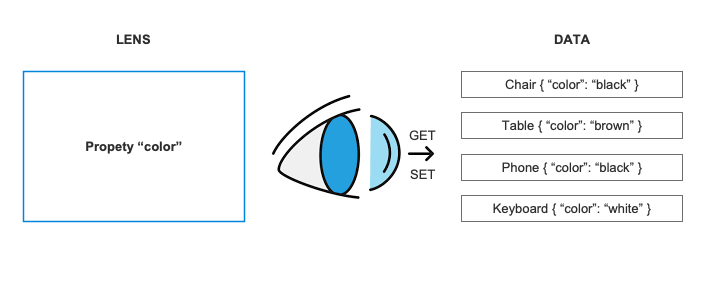

# 🔍 Lenses of Clarity

Focus on what matters most.
Our lenses provide a crystal-clear view, allowing you to zero in on specific data points without the distraction of unnecessary details.
Precision meets simplicity in every line of code.

<div align="center">
    
</div>

Lenses, in the realm of optics, act as your data's precision-guided magnifying glasses.
Think of them as focused spotlights that allow you to zoom in on specific details within your data without being bogged down by the noise around it.
Like a photographer adjusting the lens to capture the perfect shot, lenses enable you to fine-tune your view, isolating and manipulating exactly what you need.
They bring clarity to the intricacies of your data, offering a straightforward and elegant way to extract, modify, or navigate through the heart of your information with surgical precision.

Let's dive into a small example:

# Lens

Given your data object looks like this:

```php
class Item {
    public string $value;
}
```

You can create a lens that zooms in on the `value` property of an `Item` instance.
When creating a lens, we don't care much about the data by itself, but rather about what the data structure looks like.
A (not so safe) example lens for this example could be this one:

```php
use VeeWee\Reflecta\Lens\Lens;

$objectValueLens = new Lens(
    get: fn (Item $item): string => $item->value,
    set: function (Item $item, string $value): Item {
        $new = clone $item;
        $new->value = $value;
        
        return $new;
    },
);
```

This lens will allow you to fetch and manipulate data like this:

```php
$item = new Item();
$item->value = 'Hello there!';

$theValue = $objectValueLens->get($item);
// > "Hello there!"
$newItem = $objectValueLens->set($item, 'Hello back to you!');
// > Item { value: "Hello back to you!" }
$newItem = $objectValueLens->update($item, fn (string $oldValue) => $oldValue . ' Have a nice day!');
// > Item { value: "Hello there! Have a nice day!" }
```

You can pass in any instance of `Item` and it will work as expected.


## Composability

Things get fun once you start composing lenses.
Think about this about having deeply nested objects.
If you have a data structure that looks like this:

```php
class Person {
    public Hat $hat;
}

class Hat {
    public string $color;
}
```

If you want to grab the color of the hat, you could compose a lens like this:

```php
use function VeeWee\Reflecta\Lens\property;

$hatLens = property('hat');
$colorLens = property('color');
$personsHatColorLens = $hatLens->compose($colorLens);

$person = new Person();
$person->hat = new Hat();
$person->hat->color = 'green';

$theColor = $personsHatColorLens->get($person);
// > "green"
$newPerson = $personsHatColorLens->set($person, 'red');
// > Person { hat: { color: "red" }}
```

## Functions

#### compose

This function is able to compose multiple lenses into a new one.
Check the chapter [composability](#composability) for more information.
A psalm plugin is available that validates if the types of the lenses are composable.

```php
use function VeeWee\Reflecta\Lens\compose;

$personsHatColorLens = compose(
    $hatLens,
    $colorLens,
    // ...others
);
```

#### index

This function returns an index Lens that operates on `array<array-key, mixed>`.
You can specify either a numeric index or an index by name.

* **Get** will fetch the array item by key or throw an `ArrayAccessException` if the key cannot be found.
* **Set** will make a copy from the input array and change the index in that new version of the array.


```php
use function VeeWee\Reflecta\Lens\index;

$dict = ['a' => 'Apple', 'b' => 'Blueberry'];
$vec = ['a', 'b', 'c'];

index('b')->get($dict);
// > Blueberry
index(1)->get($vec);
// > b

index('b')->set($dict, 'Banana');
// > ['a' => 'Apple', 'b' => 'Banana']
index(1)->set($vec, 'Banana');
// > ['a', 'Banana', 'c']
```

#### optional

This function returns an optional Lens that decorates another lens.
It's comparable to the null-safe operator `?->` in PHP:
If the property you are trying to zoom in upon does not exist, it allows you to continue code execution with a `null` value.
Internally, this lens will try to access the underlying lens and will return `null` upon errors and null returns.

* **Get** will try to get() from the decorated lens and return `null` on failure. 
* **Set** will try to set() from the decorated lens and return `null` on failure.

```php
use function VeeWee\Reflecta\Lens\optional;
use function VeeWee\Reflecta\Lens\property;

$optionalValueLens = optional(property('value'));

$optionalValueLens->get(new class {
    public string $value = 'hello';
});
// > "hello"
$optionalValueLens->get(new class {});
// > null


$optionalValueLens->set(new class {
    public string $value = 'hello';
}, 'world');
// > Object {value: "world"}
$optionalValueLens->set(new class {}, 'world');
// > null
```

Since this is a very common lens, a shortcut got added to any `Lens` instance in order to make it optional:

```php
$optionalLens = $lens->optional();
```

#### properties

This function will create a lens that can zoom in on an object's properties (with any visibility).

* **Get** will find all properties from the given object and return a `array<string, mixed>` that contains the property name as key and the property value as value.
* **Set** will create a copy of the provided object and will use the provided `array<string, mixed>` to store back the values onto this new cloned object.

```php
use function VeeWee\Reflecta\Lens\properties;

class Item {
    public string $value = 'hello';
}

$propertiesLens = properties();

$propertiesLens->get(new Item());
// > ["value": "hello"]

$propertiesLens->set(new Item(), ['value': 'world']);
// > Item { value: "world" }
```

Additionally, you can pass a predicate to filter the properties you want to zoom in on:

```php
use VeeWee\Reflecta\Reflect\Type\Visibility;
use function VeeWee\Reflecta\Lens\properties;
use function VeeWee\Reflecta\Reflect\Predicate\property_visibility;

class Item {
    public string $value = 'hello';
    private string $hidden = 'hidden';
}

$propertiesLens = properties(property_visibility(Visibility::Public));

$propertiesLens->get(new Item());
// > ["value": "hello"]

$propertiesLens->set(new Item(), ['value': 'world', 'hidden' => 'is-ignored']);
// > Item { value: "world", hidden: "hidden" }
```

#### property

This function will create a lens that can zoom in on one named object's property (with any visibility).

* **Get** will find the value of the requested property in the provided object.
* **Set** will create a copy of the provided object and will set the provided value of the requested property into this new object.

```php
use function VeeWee\Reflecta\Lens\property;

class Item {
    public string $value = 'hello';
}

$propertyLens = property('value');

$propertyLens->get(new Item());
// > "hello"

$propertyLens->set(new Item(), ['value': 'world']);
// > Item { value: "world" }
```

#### read_only

This function will create a lens that can only be used to get the value of the provided value.

* **Get** will try to get() from the decorated lens
* **Set** will throw a `ReadonlyException` when trying to set a value.

```php
use function VeeWee\Reflecta\Lens\property;
use function VeeWee\Reflecta\Lens\read_only;

$readonlyValueLens = read_only(property('value'));

$readonlyValueLens->get(new class {
    public string $value = 'hello';
});
// > "hello"


$optionalValueLens->set(new class {
    public string $value = 'hello';
}, 'world');

// > Throws ReadonlyException
```

The main Lens class has a shortcut function as well to create a readonly lens from a getter:

```php
use VeeWee\Reflecta\Lens\Lens;

$getter = fn (mixed $item): mixed => $item;
$lens = Lens::readonly($getter);
```
